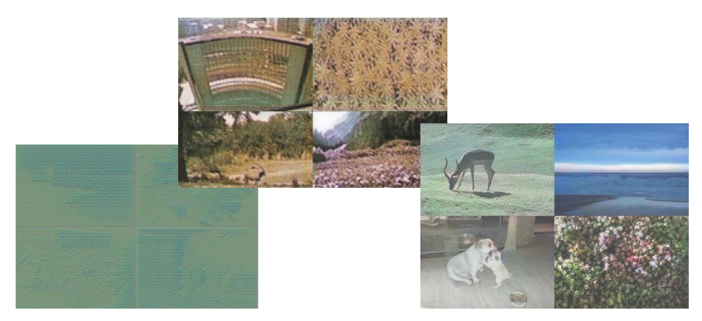
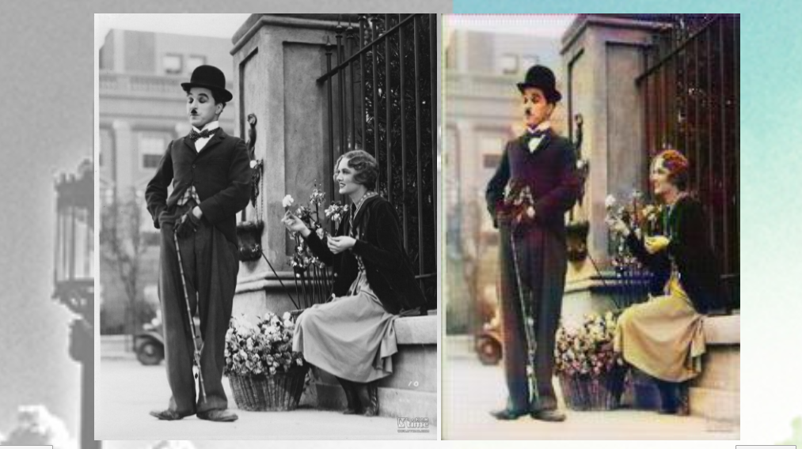

# CGAN_colorization
Using CGAN to colorize BW images. Tensorflow version.

The generator and discriminator are both deep convolution layers with batch normalization, there are no fully connected layers in this model. And by using dynamic shape in tensorflow, this model can not only deal with images that have the same size of training examples, but also images with various size (as long as it fits the memory).

## Training Samples

## Result

